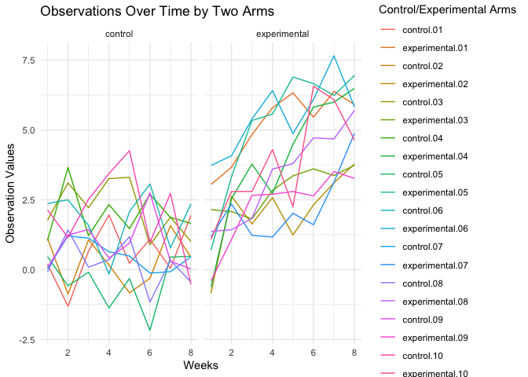

HW5
================
Tara Zhan
2023-11-10

## Problem 2

``` r
file_list <- list.files(path = "data", pattern = "*.csv", full.names = TRUE)
read_file <- function(file_list) {
  data <- read_csv(file_list)
  id <- str_extract(file_list, "\\d+")
  arm <- if_else(str_detect(file_list, "con"), "control", "experimental")
  data = data |>
    mutate(id = id, arm = arm)
  return(data)
}
combined_data = map_df(file_list, read_file)
pivot_data = combined_data |>
  pivot_longer(
    cols = starts_with("week"), 
    names_to = "week", 
    values_to = "values"
  ) |>
  mutate(week = parse_number(week))
plot_data = pivot_data |>
  group_by(arm, id)
ggplot(plot_data, aes(x = week, y = values, group = id, color = interaction(arm, id))) +
  geom_line() +
  facet_grid(~arm) +
  labs(title = "Observations Over Time by Two Arms",
       x = "Weeks", y = "Observation Values", color = "Control/Experimental Arms") +
  theme_minimal()
```

<!-- -->

Based on the spaghetti plot, the experimental groups clearly show a
higher overall observation values than the control groups. The
experimental groups have an increasing trend, and the control groups
have a more fluctuated trend.

## Problem 3
